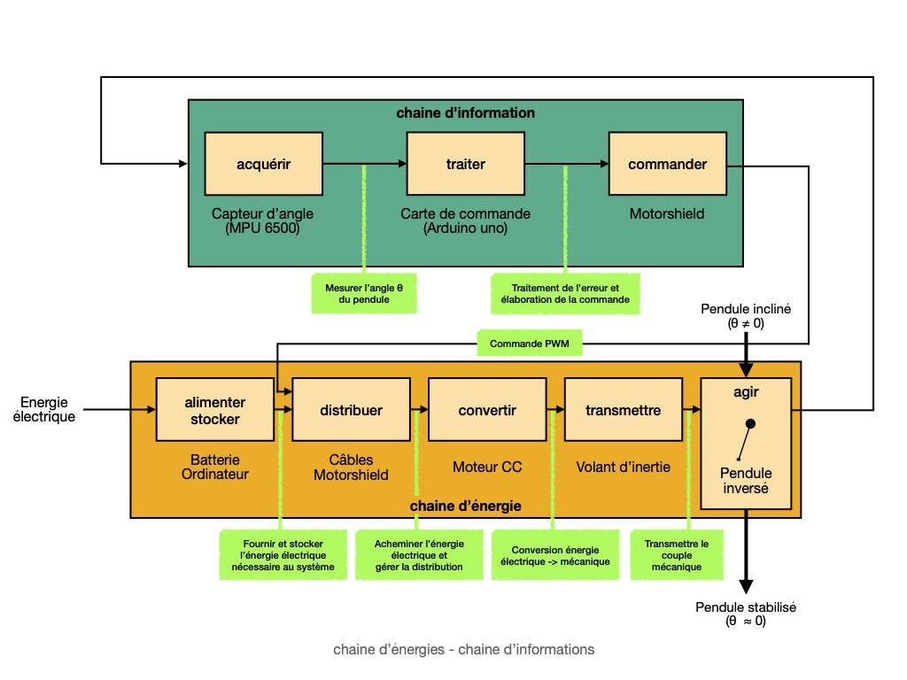
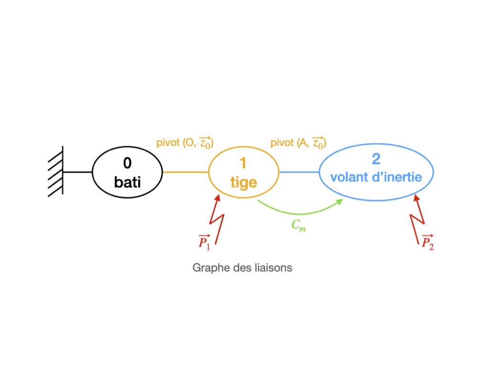
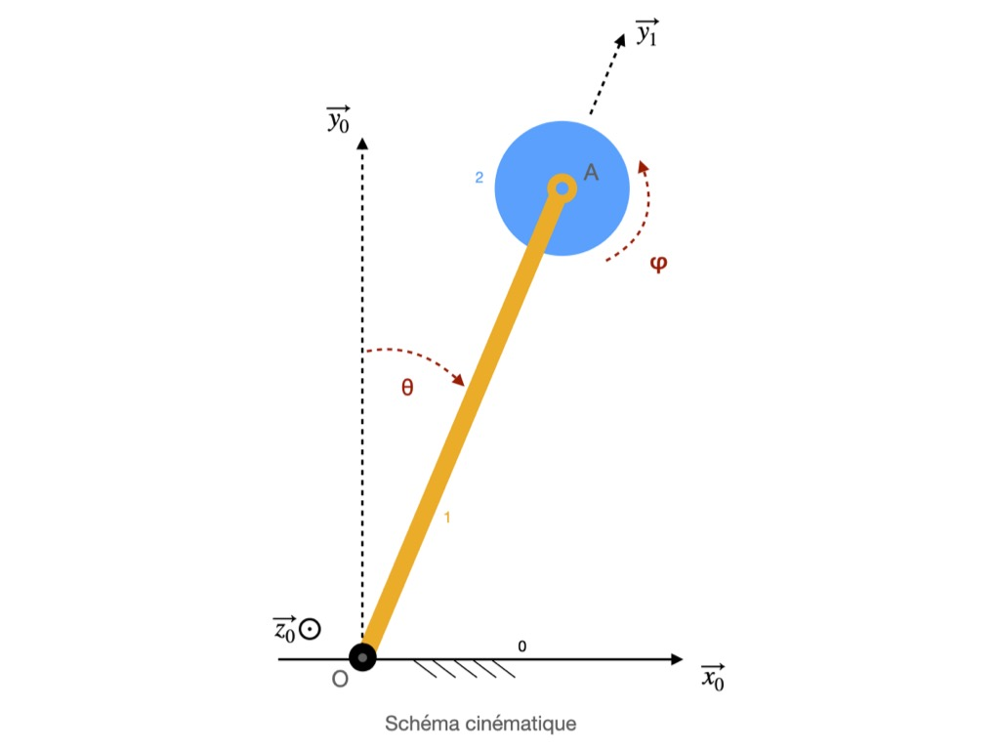

# . TIPE 2026 – Portfolio

### Accès direct au portfolio

➡️ **[Ouvrir le portfolio TIPE](https://seyli132.github.io/TIPE_2026_Portfolio)**

---
</a>

---

Ce dépôt présente les éléments principaux de mon **TIPE 2026**, consacré à l’étude de la **stabilisation dynamique des robots anthropomorphes** à partir du modèle du **pendule inversé à volant d’inertie**.

Le **portfolio associé** rassemble uniquement les **vidéos expérimentales du projet**, permettant d’illustrer les essais réalisés et le comportement du système étudié.

---

# . Sujet du TIPE

**Stabilisation dynamique de robots anthropomorphes : étude par régulation inertielle à volant d'inertie d’un pendule inversé et critères de capturabilité.**

Le pendule inversé constitue un modèle de référence pour l’étude de la stabilisation des systèmes instables.  
Dans ce projet, la stabilisation est réalisée par un **volant d’inertie de réaction**, qui génère un couple stabilisant par redistribution du moment cinétique interne.

Cette approche permet d’analyser les principes fondamentaux de la stabilisation posturale utilisés en **robotique humanoïde**.

---

# . Problématique

**Dans quelles conditions un système instable modélisé par un pendule inversé peut-il être stabilisé par une boucle de rétroaction inertielle, et quels critères physiques permettent de décider du recours à un déplacement du support ?**

---

# . Architecture du système

## . Chaine d'énergie et d'information

Ce schéma présente l’architecture fonctionnelle du système, distinguant :

- la **chaine d’énergie**, responsable de l’action mécanique  
- la **chaine d’information**, comprenant capteurs, commande et traitement du signal.

---

## . Graphe des liaisons

Le graphe des liaisons décrit la structure mécanique du système et les interactions entre les différents solides.

Il constitue la base de la **modélisation cinématique et dynamique**.

---

## . Schéma cinématique

Le schéma cinématique permet de représenter les **degrés de liberté** et les relations de mouvement nécessaires à l’établissement du modèle dynamique.

---

# . Démarche scientifique

Le travail s’articule autour de trois axes principaux :

**1. Modélisation dynamique**

Établissement du modèle du pendule inversé à volant d’inertie à partir des équations de la dynamique.

**2. Stabilisation par asservissement**

Conception d’une **boucle de rétroaction en position angulaire** permettant la stabilisation autour de la position verticale.

**3. Analyse des limites physiques**

Étude des limitations liées :

- à la saturation du moteur  
- aux contraintes énergétiques  
- à la vitesse maximale du volant d’inertie.

Ces limites conduisent à introduire un **critère de capturabilité**, inspiré du concept de **Capture Point** utilisé en robotique humanoïde.

---

# . Contenu du portfolio

Le portfolio contient uniquement :

- les **vidéos expérimentales du système**
- les **démonstrations de stabilisation**
- les **tests expérimentaux réalisés sur la maquette**

Ces ressources visuelles complètent le dossier scientifique du TIPE.

---

# . Auteur

DAOUDI Ilyes Azouz  
CPGE PSI – TIPE 2026  

GitHub :  
https://github.com/Seyli132
